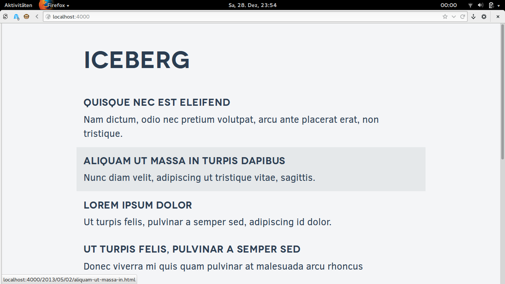

Iceberg
=======

A minimalist [Jekyll](http://jekyllrb.com/) theme for blogs with a fully responsive, mobile-first layout.



## Usage

###Install Jekyll
First, you have to install Jekyll. Just follow the instructions from the [official docs](http://jekyllrb.com/docs/quickstart/) for your OS. If you're not familiar with Jekyll yet it's probably a good idea to skim through the rest of the docs as well.

### Clone Repo
Then clone this repository on your computer.

```bash
$ git clone https://github.com/bertob/iceberg.git
```

### Test Site
Open the folder in a terminal. To test the page, start a local server by running this:

```bash
$ jekyll serve -w
```

Now if you open <http://localhost:4000> in the browser, you'll see the site, always auto-updating if you change the content of the folder.

### Customize Site
Now you can remove the example content, add your personal branding and customize the site to fit your needs.
Happy hacking :D

## License
Iceberg is developed by [Tobias Bernard](http://tobiasbernard.com/) and released under the [GNU GPLv3](http://www.gnu.org/licenses/gpl-3.0.html) or later.
